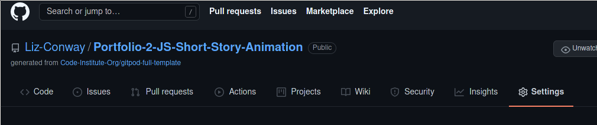
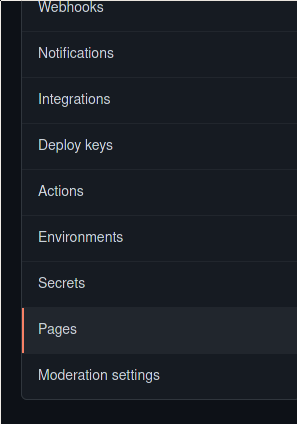
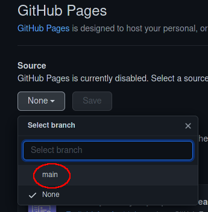
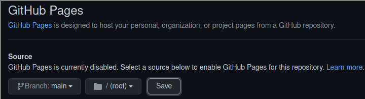
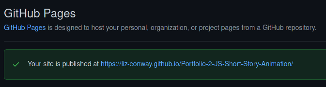
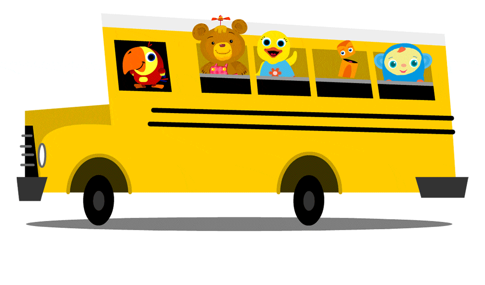
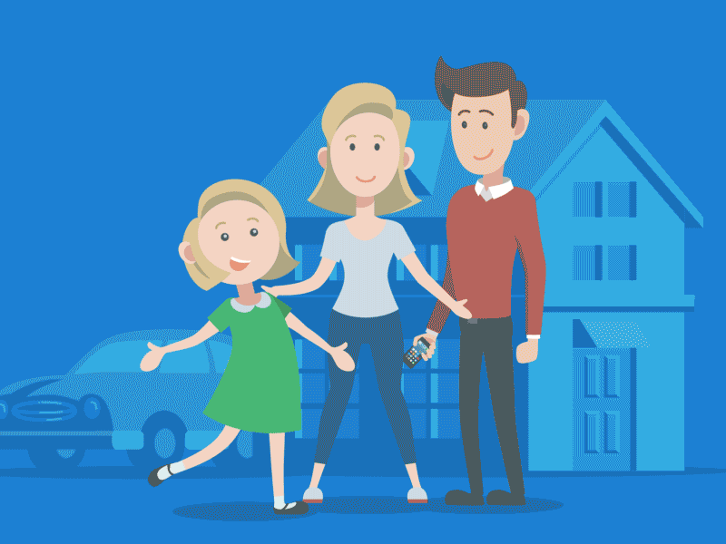

# Social Story Animation

## Overview
## Features
### Future features to implement

### Known Bugs
* Click Pause after the audio/typing has finished, then when you play again there can be more than one audio track playing at the same time.
* Does not scroll on desktop - remove top padding?
* nimated gifs do not pause when the story is paused.
* When user sets the font size to large on their browser, text overflows the speech bubble.
* Slight delay in changing the picture on smaller devices.
* Typing stuttering is back!
## UX
### Storyboard

### Accessibility
* This Social Story Animation can be controlled with only the keyboard (no mouse needed)

## Design Decisions
### Colour
A colour palette was generated from [coolors](https://coolors.co).  The colours generated and used in the Social Story Animation website are:
* Midnight Blue - #191970
* Tumbleweed - #F3B391
* Dark Moss Green - #3F612D
* Dark Slate Grey - #394F49
* Canary - #FFFE87

### Layout and Visual Impact
#### Non-image treatment
* All audio was created using [Speecholo](https://app.blasteronline.com/speechelo/)
* 
## Software Development Process

### Validation
**CSS** was validated using [W3C CSS validator](https://jigsaw.w3.org/css-validator/validator)

**HTML** was validated on the index page using [W3C HTML validator](https://validator.w3.org/)

**Javascript** was validated using [JSHint](https://jshint.com)

Both warnings relate to code that was taken from other code that has been sourced and is documented elsewhere.
### Documentation  
- README.md :  Comprehensive overview of the Short Story Animation website detailing how it works, what its features are, the technologies involved and all the design decisions that were made in creating this infographic animation.
- [Vision doc](documentation/vision-document-carol-grey-social-stories-portfolilio-2-js.docx) :  Business needs and feature list.

### Deployment
This project is deployed to [Github Pages](https://liz-conway.github.io/Portfolio-2-JS-Short-Story-Animation/)

1. Push the code to Github using `git push`.

2. Go to the Github repository [Social Story Animation github repository](https://github.com/Liz-Conway/Portfolio-2-JS-Short-Story-Animation)

3. In the Github repository, click on the *Settings* menu option.

4. Scroll down to and select the *Pages* section.

5. Choose the *main* branch to deploy

6. Save the GitHub Pages selection

7. After a few minutes the site was deployed.

## Credits
### Original Story
**Owner**: Carol Grey
**Story**: [My Story About
Pandemics and the Coronavirus](https://carolgraysocialstories.com/wp-content/uploads/2020/03/Pandemics-and-the-Coronavirus.pdf)

### Code

| Name                                                   | Owner                     | Downloaded and/or adapted from                                                                                                                                                             |
| ------------------------------------------------------ | ------------------------- | ------------------------------------------------------------------------------------------------------------------------------------------------------------------------------------------ |
| Javascript Progress bar                                | W3 Schools                | [Javascript Progress bar](https://www.w3schools.com/howto/howto_js_progressbar.asp)                                                                                                        |
| Updating scene number and total scenes                 | Code Institute            | [Love Maths - Update scores](https://learn.codeinstitute.net/courses/course-v1:CodeInstitute+LM101+2021_T1/courseware/2d651bf3f23e48aeb9b9218871912b2e/8775beaed6ed403d92318845af971b30/)  |
| JS Library to type text                                | Matt Boldt                | [typed.js](https://github.com/mattboldt/typed.js/)                                                                                                                                         |
| JavaScript Timing functions                            | W3 Schools                | [W3 Schools JS Timing](https://www.w3schools.com/js/tryit.asp?filename=tryjs_timing2)                                                                                                      |
| Passing parameters to JS Timeout function              | programiz.com             | [Pass parameter to setTimeout()](https://www.programiz.com/javascript/examples/pass-parameter-setTimeout)                                                                                  |
| Play audio file in Javascript                          | DelftStack                | [Audio in Javascript](https://www.delftstack.com/howto/javascript/play-audio-javascript/)                                                                                                  |
| Speech Bubble                                          | Dave Alger                | [Speech Bubble CSS](https://codepen.io/run-time/pen/VNRBJd)                                                                                                                                |
| Code for running multiple timeouts                     | W3 Schools                | Javascript timeout run forever able to stop](https://www.w3schools.com/jsref/tryit.asp?filename=tryjsref_win_settimeout_cleartimeout2)                                                     |
| Javascript to Add class to HTML element                | W3 Schools                | [Add class to HTML element](https://www.w3schools.com/howto/howto_js_add_class.asp)                                                                                                        |
| Javascript to Remove class from HTML element           | W3 Schools                | [Remove class from HTML element](https://www.w3schools.com/howto/howto_js_rempve_class.asp)                                                                                                |
| Check if a HTML element has a particular class         | Learn Javascript Blog     | [Check class on HTML element](https://blog.learnjavascript.online/posts/javascript-has-class/)                                                                                             |
| Javascript to remove the last character from a string  | HereWeCode                | [Remove last character](https://herewecode.io/blog/remove-last-character-string-javascript/)                                                                                               |
| Reset audio to beginning of track                      | Mozilla Developer Network | [Reset Audio](https://developer.mozilla.org/en-US/docs/Web/API/HTMLMediaElement/currentTime)                                                                                               |
| Javascript code to run after page has finished loading | Code Institute            | [DOM loaded code](https://learn.codeinstitute.net/courses/course-v1:CodeInstitute+LM101+2021_T1/courseware/2d651bf3f23e48aeb9b9218871912b2e/78f3c10a937c4fe09640c7c0098d16bd/)             |
| Javascript - Event listeners for buttons               | Code Institute            | [Event listeners for buttons](https://learn.codeinstitute.net/courses/course-v1:CodeInstitute+LM101+2021_T1/courseware/2d651bf3f23e48aeb9b9218871912b2e/78f3c10a937c4fe09640c7c0098d16bd/) |
| Javascript - Mute & Unmute audio                       | DevelopPHP.com            | [(Un)mute audio](https://www.developphp.com/video/JavaScript/Audio-Play-Pause-Mute-Buttons-Tutorial)                                                                                       |
| Javascript - Add attribute to HTML element             | Stack Overflow            | [Add attribute](https://stackoverflow.com/questions/27466969/how-to-add-attribute-to-html-element-using-javascript)                                                                        |
| Javascript - Add background image                      | DelftStack                | https://www.developphp.com/video/JavaScript/Audio-Play-Pause-Mute-Buttons-Tutorial                                                                                                         |
| Using REMs in CSS                                      | Aleksandr Hovhannisyan    | https://www.aleksandrhovhannisyan.com/blog/respecting-font-size-preferences-rems-62-5-percent/#is-this-accessible  |
|           EM based media queries                       |  Lyza Gardner             |             https://cloudfour.com/thinks/the-ems-have-it-proportional-media-queries-ftw/                                                                                   |
|           Javascript event handler keydown                       | Go Make Things             |             https://gomakethings.com/named-vs-anonymous-event-listener-functions                                                                  |

### Pictures

| Picture                    | Name | Owner           | Downloaded and/or adapted from|
| --- | -------------------------- | --------------- | ---------------------------------------------------------------------------------- |
|| World Pandemic           | [Martin Sanchez](https://unsplash.com/@martinsanchez) | [Unsplash](https://unsplash.com/s/photos/pandemic)|
||Healthy Emoji|[Ann H](https://www.pexels.com/@ann-h-45017)|[Pexels](https://www.pexels.com/photo/man-people-blur-ball-7313320/)|
||Grumpy Covid Virus | tenor.com | https://www.pinterest.fr/pin/313492824066573963/ |
|| young person on world | Mercer University | https://den.mercer.edu/students-animations-depict-how-covid-19-impacts-daily-routines/
|  |Animated light bulb | animatedimages.org | https://www.animatedimages.org/cat-light-bulb-510.htm |
|  |Wash Hands | NewYork-Presbyterian | https://healthmatters.nyp.org/tag/soap/ |
|  |Speaker | icons8.com | https://img.icons8.com/ios/2x/speaker.png |
|  |Muted Speaker | icons8.com | https://img.icons8.com/ios/2x/speaker.png |
|  |Keep your distance | William Garrat | https://giphy.com/gifs/stayathome-staysafe-keep-your-distance-lRijoaJYDzQ7fGkqTr |
|  |Schools are closed | img.freepik.com | https://img.freepik.com/free-vector/cartoon-background-with-empty-classroom-interior-inside_1441-1735.jpg?size=626&ext=jpg |
|  |Schools are closed | Grant Fisher | https://dribbble.com/shots/2477332-School-Bus |
|  |Schools are closed | BabyFirst | https://giphy.com/gifs/BabyFirst-bus-backtoschool-babyfirst-YlYvNi3peKT6gsyurj |
|  |Going on Holiday | StoryboardThat | https://www.storyboardthat.com/ |
|  |Changing calendar | PresenterMedia | https://www.presentermedia.com/powerpoint-animation/pages-tearing-off-calendar-pid-10077 |
|  |Parents look out for child | June Ahn | https://cdn.dribbble.com/users/1080395/screenshots/3058163/a-happy-girl-with-her-family.gif |
|  |Belting covid | Roberto Mangosti | https://www.pinterest.ie/pin/754775218791429884/ |
|  |Favicon |Twemoji([copyright Twitter 2020](https://creativecommons.org/licenses/by/4.0/))| https://favicon.io/emoji-favicons/face-with-medical-mask |

