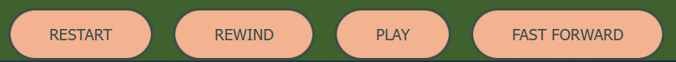
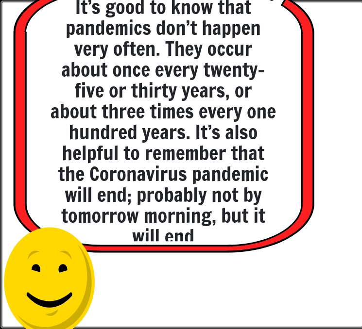

# Social Story Animation

## Overview
### Who is this app for?
Social Story Animation infographic is for children, teens and adults with Autism Spectrum Disorder (ASD).  Often people who present with the ASD diagnosis may be non-verbal and/or require a multi-sensory approach to communication.  The more multisensory the “message”  the better the communication outcome and the successful interpretation of the message.
 
### What does it do?
 The Social Story Animation infographic takes the [official covid-19 pdf](documentation/original/pandemics-and-the-coronavirus.pdf) guide by Carol Gray and animates the message.  Social Story Animation will be used by people who are on the ASD spectrum and as a visual guide for parents to navigate broad understanding across what is a relevant and emotive topic. It hopes to bridge the gap within the current covid-19 information guidelines.  It will be used as an opportunity to solidify concepts, understanding and offer a positive message of hope and resilience to a broad audience.
 
 It can be a minefield for people who struggle with the daily nuances of communication and need a reference and guide to navigate proper interpretation of the written and unspoken  word.  The aim is to evoke a neural response and consequently influence behaviour and outcome.
 
 Selective, notable sources of information for people on the spectrum are important in both their service and the delivery of their messages.  The Carol Gray short stories are a proven and important medium for people with Autism to learn about the world around them.  It helps them to decipher information that would otherwise be over-stimulating and creating a sensory overload.  Social short stories help people to navigate the perilous and often intrusive overload of disturbing information.  Social short stories aid understanding, target a user profile and help with the nuances that non-verbal communication can display.  
 
 A picture is worth a “thousand words” and a multisensory approach takes that message and helps create that neural connection by engaging as many senses as possible.  The more the senses are engaged the deeper the meaning and the lasting effect.  Communication flows and this allows people to absorb, understand and make sense of the world around them that is both visually appealing and non-threatening.  Innovative approaches to messaging and to learning help us understand the subliminal messages that can be automatically invoked in neuroatypical individuals.  Neuroatypical individuals require deliberate, innovative approaches to aid understanding and help them navigate the world we inhabit.  The more appealing the stimuli the easier it is to absorb its message producing lasting effect both in thought and behaviour.

### How does it work
The Social Story Animaiton infographic explores how to contextualise and convert the static information into a fully multi-sensory infographic to help people with special needs to understand the covid-19 pandemic.  Social Story Animation's goal is to support children, teens, and adults with special needs to understand the message in a hopeful and meaningful way.

A Social story is a short, personalised story written in a dedicated and specific style and format.  The original social short story is presented as a series of slides, each with a large background picture and accompanying text.  The Social Story Animation infographic presents each of the original slides as a scene containing an animated picture, animated typing and audio description of the text.

## Screen Mockups
This screen mockup was created for the Social Story Animation website using the [Multi Device Website Mockup Generator](https://techsini.com/multi-mockup/index.php) from techsini.com.


## Features
### Existing Features
1. **Site navigation**

Navigation of the Social Story animation infographic is accomplished by using the following buttons:


* Play - The only button the person sees when the infographic loads.  This is because the animation has not started yet, so none of the other navigation options are applicable yet.  Pressing this button will start the animation playing.  If the animation has been paused then pressing the Play button will continue the animation from the point at which it had been paused.
  Once the play buttons is pressed and the animation is running the pause button appears.
* Pause - Pressing the Pause button stops the animation.  The Restart, Rewind, Play and Fast Forward buttons appear allow the person to navigate to other scenes, or continue playback from the stopped point.
* Restart - Pressing Restart starts the animation from the beginning of Scene 1.  Once the animation is restarted the Pause button is the only button visible.
* Rewind - When the animation is paused the person can choose to rewind to the previous scene.  This button is not available when Pause has been pressed on the first scene, since there is no previous scene.
* Fast Forward - When the animation is paused the person can choose to fast forward to the next scene.  This button is not available when Pause has been pressed on the last scene, since there is no next scene.

The use of easy, intuitive controls allow the viewer to simply and effectively navigate the Social Story Animation infographic.

Care has been taken that only relevant actions can be taken by the viewer.  No button is shown if its action cannot be performed at that time.

2. **Animated presentation of message**

Each scene contains an animated image which appeals to the visual senses and draws the observer in.


The images are deliberately cartoon-like.  This is a deliberate decision to make the infographic fun and appealing.  For people who can finish reading the text quickly, the animated image keeps their attention long enough for them not to lose interest before the next scene starts.

3. **Textual presentation of message**

The original text from Carol Grey's social story is used as Carol wrote it.  This text is animated, appearing as if it was being typed onto the screen character by character.


Dynamic, rather than static, text draws the eye and keeps the person's attention.  People will keep looking to see what will come next.  This will appeal to visual learners and help to emphasise the message so that it will not easily be forgotten.

4. **Auditory presentation of message**

A voiceover file plays during the animation of a scene.  As the text for a scene is appearing the voice speaks the words of the text at the same time.  This audio is synchronised to the appearance of the text.
[Voiceover for scene 9](assets/audio/scene9.mp3)
Sometimes it can be easier to listen rather than to read a block of information.  Listening to the voiceover will reduce the cognitive burden on the person interacting with the animation infographic.  This leaves more of the person's cognition for accepting and remembering the message given.

5. **Multi-sensory presentation of message**

Each scene that plays has an animated image, animated text and a voiceover playing.  This appeals to multiple senses.
This multi-sensory nature of the Social Story animation infographic will allow people with ASD to accept, absorb and decipher the message presented to them.

6. **Timing**

Some people with ASD *may* have an issue with reading.  Each scene is 25 seconds long.  This is longer than the text/audio takes to complete.  The gap between the end of one scence ending and another starting gives slow readers the chance to read the entire text before the next image appears.  This avoids any frustration with a viewer not being able to finish reading the text before it disappears and the next scene appears

7. **Feedback**

Once the animation is running, the viewer is shown which scene they are on and how many scenes in total the animation runs for.  This sets the viewer's expectations.  They know how many scenes there are, and can figure out how many are left before the animation ends.  There is no confusion about what is happening.


As the scene runs a progress bar shows how much of the scene has run already.  This allows the viewer to see visually how much is left before the next scene will appear.  This removes any confusion about why the scene has not moved on to the next one yet.

 

8. **Control of sound**

The viewer can turn the sound on and off at any time.  This is achieved by pressing the 'Speaker' image on the bottom right-hand corner of the screen.  When pressed the image changes to the same image with a red cross through it, and the sound stops (is muted).  Pressing this new image causes the sound to come on again, still synchronised to the text.  Also the image changes back to the normal 'Speaker' image.
This give the viewer full control of muting and unmuting the sound.


     

9. **Display of instructions**

The initial screen displays instructions on how to use the buttons, and when they will appear.


Each button (including the speaker image) has a tooltip containing instructions for what the button's purpose is.


These instructions help the viewer who is unsure of what capabilities are available in the Social Story Animation infographic to learn what options they have.

### Future features to implement

### Known Bugs
* Click Pause after the audio/typing has finished, then when you play again there can be more than one audio track playing at the same time.
* Animated gifs do not pause when the story is paused.  This is due to the nature of the animated gifs - they are set to loop forever.
* Slight delay in changing the picture.

## UX
### Storyboard



### Personas


### Customer Journey Maps


### User Flow

### Site Map


### Accessibility
* This Social Story Animation can be controlled with only the keyboard (no mouse needed).  This was achieved by using `tabIndex` on all elements that act as buttons.  Javascript code was written to react to the `Enter` or `Space` keys being pressed.
* The voiceover for every scene makes this animation infographic easily accessible to people with poor or no vision.
* The speaker image which is used to mute/unmute the sound for the animation infographic has a `role` set to "button" so that screen readers will be able to announce that the images intended purpose is to be used as a button.  It also has an `aria-pressed` attribute so that the screen reader will know that it is a "toggle" button.

The Social Story Animation website was checked to ensure accessibility using the [WAVE](https://wave.webaim.org/) web accessibility evaluation tool. 


A Lighthouse report was also generated.


## Design Decisions
### Code Quality
- **Correct use of HTML** 
    - Use HTML5 Semantic elements
- **Correct use of CSS** 
    - Use Flexbox for page layout
- **Correct use of Javascript** 
    - Separate tasks into clearly defined functions.
    - Use event listeners to respond to button clicks and interactions with images.
    - Prevent the animation from playing until the entire page is loaded using a `DOM Content loaded` event listener.
    - Use setTimeout() function to manage the timing of the animation.

### Colour
A colour palette was generated from [coolors](https://coolors.co).  The colours generated and used in the Social Story Animation website are:
* Midnight Blue - #191970
* Tumbleweed - #F3B391
* Dark Moss Green - #3F612D
* Dark Slate Grey - #394F49
* Canary - #FFFE87

### Non-image treatment
* A single text font has been used throughout the Social Story Animation infographic.
* All audio was created using [Speecholo](https://app.blasteronline.com/speechelo/)
* Audio for each screen is synchronised with the text for the scene.  The voiceover matches the text as the text is typed out on the screen.

### Usability
- **Suitability for purpose**
    - Social Story Animation provides textual, visual and auditory information to the viewer.
    - The information provided by Social Story Animation is the exact same information that Carol Grey developed for her Social Story.  The only difference is that Social Story Animation presents this information in an animated, multi-sensory way.
- **Ease of use**
    - A simple easy-to-use application focusing on reducing the 'cognitive load' on viewers.  The system is designed so that the viewer does not have to remember large amounts of detail.
- **Information Display** 
    - The initial screen gives instructions on how to use the Social Story Animation.
    - Buttons are accurately labelled so that their use is intuitive.
    - The speaker image is a common signifier, which is used widely and commonly known to represent the mute/unmute ability of a web site/app.
    - Each button (including the speaker image) has a tooltip which gives explicit instructions on its use.


## Layout and Visual Impact
### Responsive Design
* "Desktop First" design philosophy
*  FlexBox is used to give responsive layouts
*  Media Queries are used for each different screen size the animation will be run on.


### Navigation
* The Restart button is shown whenever the animation is paused.  This button allows the viewer to run the animation from the beginnning.
* The Rewind button is shown whenever the animation is paused, unless the animation is paused on the very first scene.  This button allows the viewer to run the animation from the previous scene.
* The Play button is shown on its own at the when the animation is forst loaded, or whenever the animation is paused.  This button allows the viewer to start the animation, or continue running the animation from its current point.
* The Pause button is shown on its own whenever the animation is playing.  This button allows the viewer to stop the animation.	When Pause is pressed the other buttons are shown, except the Rewind button if on the first scene, or the Fast Forward button on the last scene.
* The Fast Forward button is shown whenever the animation is paused, unless the animation is paused on the very last scene.  This button allows the viewer to run the animation from the next scene.
	
### Image Treatment 
Images are compressed to reduce download times.  [compresspng.com](https://compresspng.com/) was used to compress the  image files.

### Wireframes
**Scene 1**

**Scene 2**

**Scene 3**

**Scene 4**

**Scene 5**

**Scene 6**

**Scene 7**

**Scene 8**

**Scene 9**


## Software Development Process
### Version Control 
**Git** is used for version control of this project
- Git commit message prefix convention denoting the type of change made in this commit:
    - DOC: Documentation
    - FEAT: Feature
    - FIX: Bugfix
    - STYLE: Changes to CSS
    - ARIA: Changes to improve accessibility for the MathsBuddy website.
    - REFACTOR: Where changes are made that do not change the functionality.
- Git messages will be no longer than 50 characters long.

**GitHub** is used as the central version control repository for this project.

### Testing 
Testing is documented in the [Testing document](documentation/test/TESTING.md)
### Validation
**CSS** was validated using [W3C CSS validator](https://jigsaw.w3.org/css-validator/validator).  No errors were found.

**HTML** was validated on the index page using [W3C HTML validator](https://validator.w3.org/).  No errors or warnings were found.


**Javascript** was validated using [JSHint](https://jshint.com)


Both warnings relate to code that was taken from other code that has been sourced and is documented elsewhere.
### Documentation  
- README.md :  Comprehensive overview of the Short Story Animation website detailing how it works, what its features are, the technologies involved and all the design decisions that were made in creating this infographic animation.
- [Vision doc](documentation/vision-document-carol-grey-social-stories-portfolilio-2-js.docx) :  Business needs and feature list.
- [official covid-19 pdf](documentation/original/pandemics-and-the-coronavirus.pdf) :  "My Story About Pandemics and the Coronavirus" - Carol Gray is a teacher of special needs for the past 30 years.  Her social stories are dedicated resources used to help convey learning and meaning of information in a very specific style and format that helps people with ASD to understand the world around them.  What can be taken for granted through ordinary channels of communication and non-verbal body language can be difficult to decipher for neuroatypical people, such as those with ASD.
 

### Deployment
This project is deployed to [Github Pages](https://liz-conway.github.io/Portfolio-2-JS-Short-Story-Animation/)

1. Push the code to Github using `git push`.

2. Go to the Github repository [Social Story Animation github repository](https://github.com/Liz-Conway/Portfolio-2-JS-Short-Story-Animation)

3. In the Github repository, click on the *Settings* menu option.


4. Scroll down to and select the *Pages* section.


5. Choose the *main* branch to deploy


6. Save the GitHub Pages selection


7. After a few minutes the site was deployed.


## Technology Used

### Some of the technology used includes:
- [HTML5](https://dev.w3.org/html5/spec-LC/)
    - **HTML5** is used to develop the content of the Social Story Animation website.
- [CSS](https://www.w3.org/Style/CSS/Overview.en.html)
    - **CSS** is used to layout the HTML elements on each page of the Social Story Animations website.
- [FlexBox](https://www.w3.org/TR/css-flexbox-1/)
    - **FlexBox** is used to give the Social Story Animation website a simple, responsive layout.
- [Javascript](https://developer.mozilla.org/en-US/docs/Web/JavaScript)
    - **Javascript** is used to perform all logic and run the animation.  It is used to animation the typing of text, play audio files, manage a progress bar and navigate the scenes.
- [Typed.js](https://github.com/mattboldt/typed.js/)
    - **Typed.js** is a javascript typing animation library.  Typed.js is used to display the text for each scene in an animated, character-by-character fashion.
 
## Contributing

### Clone
1. Firstly you will need to clone this repository by running the `git clone https://github.com/Liz-Conway/Portfolio-2-JS-Short-Story-Animation.git` command
2. After you've that you'll need to make sure that you have a package manager such as **npm**  installed
  1. You can get **npm** by installing Node from [here](https://nodejs.org/en/)
3. Make sure that you have **live-server** installed. You can install this by running the following: ```npm install -g live-server``` .  This also may require sudo on Mac/Linux
4. Once **live-server** is installed run ```live-server``` in the root directory (the one where index.html is).
5. The project will now run on [localhost](http://127.0.0.1:8080)
6. Make changes to the code and if you think it belongs in here then just submit a pull request.

### Fork
1. Log into [Github](https://github.com/)
2. Search for **Short-Story-Animation** and choose to go to `Liz-Conway
Portfolio-2-JS-Short-Story-Animation`.
3. Click on the *Fork* button on the top right hand side of the screen.
4. This will make a copy of **Social Story Animation** in your github account.
5. In your version of Social Story Animation click on the `Code` button and copy the clone text.
6. Then, you will need to clone this repository by pasting the command you just copied into a terminal window on your computer and running it.  This will create a copy of Social Story Animation from your github account on your computer.
7. After you've that you'll need to make sure that you have a package manager such as **npm**  installed
  1. You can get **npm** by installing Node from [here](https://nodejs.org/en/)
8. Make sure that you have **live-server** installed. You can install this by running the following: `npm install -g live-server`  This also may require sudo on Mac/Linux
9. Once **live-server** is installed run `live-server` in the root directory (the one where index.html is).
10. The project will now run on [localhost](http://127.0.0.1:8080)
11. Make changes to the code and run `git push` to save those changes to your github account.


### Cloning versus Forking
The major difference between cloning and forking is where your updates go when you perform a `git push`.

With cloning you are pushing the updates to the `Liz-Conway/
Portfolio-2-JS-Short-Story-Animation ` repo on github.

With forking you are pushing the updates to your own Social Story Animation repo on github.

## Credits
### Original Story
**Owner**: Carol Grey

**Story**: [My Story About
Pandemics and the Coronavirus](https://carolgraysocialstories.com/wp-content/uploads/2020/03/Pandemics-and-the-Coronavirus.pdf)

### Code

| Name                                                   | Owner                     | Downloaded and/or adapted from                                                                                                                                                             |
| ------------------------------------------------------ | ------------------------- | ------------------------------------------------------------------------------------------------------------------------------------------------------------------------------------------ |
| Javascript Progress bar                                | W3 Schools                | [Javascript Progress bar](https://www.w3schools.com/howto/howto_js_progressbar.asp)                                                                                                        |
| Updating scene number and total scenes                 | Code Institute            | [Love Maths - Update scores](https://learn.codeinstitute.net/courses/course-v1:CodeInstitute+LM101+2021_T1/courseware/2d651bf3f23e48aeb9b9218871912b2e/8775beaed6ed403d92318845af971b30/)  |
| JS Library to type text                                | Matt Boldt                | [typed.js](https://github.com/mattboldt/typed.js/)                                                                                                                                         |
| JavaScript Timing functions                            | W3 Schools                | [W3 Schools JS Timing](https://www.w3schools.com/js/tryit.asp?filename=tryjs_timing2)                                                                                                      |
| Passing parameters to JS Timeout function              | programiz.com             | [Pass parameter to setTimeout()](https://www.programiz.com/javascript/examples/pass-parameter-setTimeout)                                                                                  |
| Play audio file in Javascript                          | DelftStack                | [Audio in Javascript](https://www.delftstack.com/howto/javascript/play-audio-javascript/)                                                                                                  |
| Speech Bubble                                          | Dave Alger                | [Speech Bubble CSS](https://codepen.io/run-time/pen/VNRBJd)                                                                                                                                |
| Code for running multiple timeouts                     | W3 Schools                | [Javascript timeout run forever able to stop](https://www.w3schools.com/jsref/tryit.asp?filename=tryjsref_win_settimeout_cleartimeout2)                                                     |
| Javascript to Add class to HTML element                | W3 Schools                | [Add class to HTML element](https://www.w3schools.com/howto/howto_js_add_class.asp)                                                                                                        |
| Javascript to Remove class from HTML element           | W3 Schools                | [Remove class from HTML element](https://www.w3schools.com/howto/howto_js_rempve_class.asp)                                                                                                |
| Check if a HTML element has a particular class         | Learn Javascript Blog     | [Check class on HTML element](https://blog.learnjavascript.online/posts/javascript-has-class/)                                                                                             |
| Javascript to remove the last character from a string  | HereWeCode                | [Remove last character](https://herewecode.io/blog/remove-last-character-string-javascript/)                                                                                               |
| Reset audio to beginning of track                      | Mozilla Developer Network | [Reset Audio](https://developer.mozilla.org/en-US/docs/Web/API/HTMLMediaElement/currentTime)                                                                                               |
| Javascript code to run after page has finished loading | Code Institute            | [DOM loaded code](https://learn.codeinstitute.net/courses/course-v1:CodeInstitute+LM101+2021_T1/courseware/2d651bf3f23e48aeb9b9218871912b2e/78f3c10a937c4fe09640c7c0098d16bd/)             |
| Javascript - Event listeners for buttons               | Code Institute            | [Event listeners for buttons](https://learn.codeinstitute.net/courses/course-v1:CodeInstitute+LM101+2021_T1/courseware/2d651bf3f23e48aeb9b9218871912b2e/78f3c10a937c4fe09640c7c0098d16bd/) |
| Javascript - Mute & Unmute audio                       | DevelopPHP.com            | [(Un)mute audio](https://www.developphp.com/video/JavaScript/Audio-Play-Pause-Mute-Buttons-Tutorial)                                                                                       |
| Javascript - Add attribute to HTML element             | Stack Overflow            | [Add attribute](https://stackoverflow.com/questions/27466969/how-to-add-attribute-to-html-element-using-javascript)                                                                        |
| Javascript - Add background image                      | DelftStack                | https://www.developphp.com/video/JavaScript/Audio-Play-Pause-Mute-Buttons-Tutorial                                                                                                         |
| Using REMs in CSS                                      | Aleksandr Hovhannisyan    | https://www.aleksandrhovhannisyan.com/blog/respecting-font-size-preferences-rems-62-5-percent/#is-this-accessible                                                                          |
| EM based media queries                                 | Lyza Gardner              | https://cloudfour.com/thinks/the-ems-have-it-proportional-media-queries-ftw/                                                                                                               |
| Javascript event handler keydown                       | Go Make Things            | https://gomakethings.com/named-vs-anonymous-event-listener-functions|
| Accessibillity button role                                                       |Mozilla Developer Network|     https://developer.mozilla.org/en-US/docs/Web/Accessibility/ARIA/Roles/button_role   |

### Pictures

| Picture                    | Name | Owner           | Downloaded and/or adapted from|
| --- | -------------------------- | --------------- | ---------------------------------------------------------------------------------- |
|| World Pandemic           | [Martin Sanchez](https://unsplash.com/@martinsanchez) | [Unsplash](https://unsplash.com/s/photos/pandemic)|
||Healthy Emoji|[Ann H](https://www.pexels.com/@ann-h-45017)|[Pexels](https://www.pexels.com/photo/man-people-blur-ball-7313320/)|
||Grumpy Covid Virus | tenor.com | https://www.pinterest.fr/pin/313492824066573963/ |
|| young person on world | Mercer University | https://den.mercer.edu/students-animations-depict-how-covid-19-impacts-daily-routines/
|  |Animated light bulb | animatedimages.org | https://www.animatedimages.org/cat-light-bulb-510.htm |
|  |Wash Hands | NewYork-Presbyterian | https://healthmatters.nyp.org/tag/soap/ |
|  |Speaker | icons8.com | https://img.icons8.com/ios/2x/speaker.png |
|  |Muted Speaker | icons8.com | https://img.icons8.com/ios/2x/speaker.png |
|  |Keep your distance | William Garrat | https://giphy.com/gifs/stayathome-staysafe-keep-your-distance-lRijoaJYDzQ7fGkqTr |
|  |Schools are closed | img.freepik.com | https://img.freepik.com/free-vector/cartoon-background-with-empty-classroom-interior-inside_1441-1735.jpg?size=626&ext=jpg |
|  |Schools are closed | Grant Fisher | https://dribbble.com/shots/2477332-School-Bus |
|  |Schools are closed | BabyFirst | https://giphy.com/gifs/BabyFirst-bus-backtoschool-babyfirst-YlYvNi3peKT6gsyurj |
|  |Going on Holiday | StoryboardThat | https://www.storyboardthat.com/ |
|  |Changing calendar | PresenterMedia | https://www.presentermedia.com/powerpoint-animation/pages-tearing-off-calendar-pid-10077 |
|  |Parents look out for child | June Ahn | https://cdn.dribbble.com/users/1080395/screenshots/3058163/a-happy-girl-with-her-family.gif |
|  |Belting covid | Roberto Mangosti|  https://www.pinterest.ie/pin/754775218791429884/ |
|  |Favicon |Twemoji([copyright Twitter 2020](https://creativecommons.org/licenses/by/4.0/))| https://favicon.io/emoji-favicons/face-with-medical-mask |

